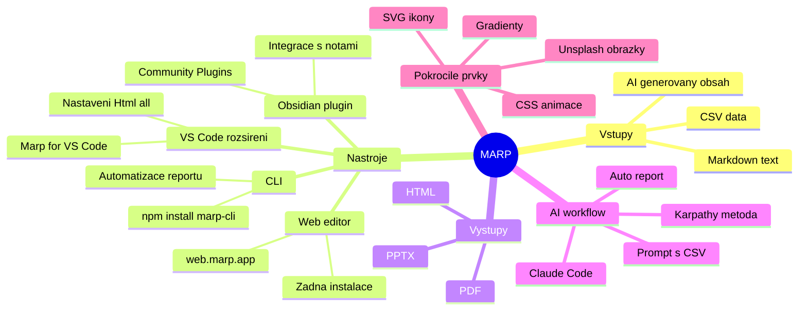

# 🎞️ MARP – Markdown Presentation Ecosystem

> [!abstract] TL;DR
> **Marp** převádí prostý Markdown text na profesionální prezentace (PDF, HTML, PPTX).
> [[Andrej Karpathy]] ho používá pro rychlé učení – nechává [[Claude Code]] generovat slidy místo čtení dlouhých textů.
> Funguje zdarma, bez přetahování boxů v PowerPointu. AI s textovým formátem pracuje mnohem lépe než s grafickými editory.

## 🧩 Co je Marp?

**Marp (Markdown Presentation Ecosystem)** je open-source nástroj, který proměňuje prostý text ve formátu [[Markdown]] v profesionální prezentace. Základní syntaxe je minimální – slidy se oddělují třemi pomlčkami (`---`).

### Podporované výstupy

- 📄 **PDF** – pro sdílení a tisk
- 🌐 **HTML** – interaktivní prezentace v prohlížeči
- 📊 **PPTX** – export do PowerPointu

### Vizuální možnosti

- Sloupcové a koláčové **grafy**
- **Tabulky** s formátováním
- **SVG ikony** (Lucide, FontAwesome)
- CSS **animace** a **gradienty**
- Simulace **terminálu**
- Obrázky z **Unsplash** (automatické stahování)
- HTML prvky (rozbalovací menu, časové osy)

-----

## ⚙️ Způsoby použití

|Nástroj                  |Pro koho                   |Instalace                           |
|-------------------------|---------------------------|------------------------------------|
|**Marp Web**             |Začátečníci                |Žádná – v prohlížeči                |
|**[[Obsidian]] + Plugin**|Studenti, analytici        |Plugin z Community Plugins          |
|**VS Code + Marp**       |Vývojáři                   |Rozšíření Marp for VS Code          |
|**Marp CLI**             |Programátoři / Automatizace|`npm install -g @marp-team/marp-cli`|

-----

## 🚀 Praktický postup (bez VS Code)

1. **Zadej data AI** – pošli Claude nebo ChatGPT tabulku / CSV a napiš:
   *„Vytvoř mi z těchto dat prezentaci ve formátu Marp Markdown.”*
2. **Zkopíruj vygenerovaný kód** – výstup začíná takto:

```markdown
---
marp: true
theme: default
---

# Název prezentace

Obsah prvního slidu

---

## Druhý slide

- Bod 1
- Bod 2
```

1. **Vlož na [web.marp.app](https://web.marp.app)** – okamžitý náhled vpravo
2. **Exportuj** jako PDF nebo HTML

-----

## 🤖 Automatizace s Claude Code

[[Claude Code]] zvládne přijmout CSV soubor a jedním promptem vygenerovat hotový report:

```bash
# Instalace Marp CLI
npm install -g @marp-team/marp-cli

# Export Markdown na PDF
marp moje-prezentace.md --pdf

# Export na HTML
marp moje-prezentace.md --html


git clone https://github.com/robonuggets/marp-slides
claude --add-dir ./marp-slides

```

**Ukázkový prompt pro Claude Code:**
*„Analyzuj přiložený CSV soubor s výsledky Facebook reklam a vytvoř Marp prezentaci s klíčovými metrikami a doporučeními.”*

**Ukázkový systémový prompt / „skill” pro AI:**
*„Chovej se jako expert na Marp. Generuj prezentace s pokročilými CSS styly, ikonami z Lucide nebo FontAwesome a moderní vizuální hierarchií. Každý slide odděluj pomocí `---`.”*

-----

## 🔧 Nastavení Marp ve VS Code

1. Nainstaluj rozšíření **Marp for VS Code**
2. V nastavení najdi: `Markdown › Marp: Html`
3. Změň hodnotu z `off` na `all` (nutné pro HTML prvky a animace)

-----

## 🗂️ Marp v Obsidianu

1. Otevři **Settings → Community Plugins**
2. Vyhledej `Marp`
3. Aktivuj plugin
4. Libovolnou notu lze jedním tlačítkem proměnit v prezentaci

-----

## 🗺️ Přehled ekosystému



-----

> [!success] Proč Marp funguje
> Textový formát Markdownu je pro AI agenty jako [[Claude]] přirozený. Na rozdíl od grafických editorů (Canva, PowerPoint) může AI přímo generovat a upravovat zdrojový kód prezentace bez nutnosti ovládat GUI.

-----

> [!tip] Karpathyho metoda rychlého učení
> Místo čtení dlouhých dokumentů v terminálu nech AI vygenerovat výstup jako Marp prezentaci. Slidy **nutí informace do přehledných vizuálních bloků** – snáze se vstřebávají a opakují.

-----

> [!tip] Vlastní „skill” bez speciálních souborů
> Nepotřebuješ stahovat nic z komunity RoboNuggets. Stačí na začátku každého chatu vložit systémový prompt s instrukcí pro generování Marp Markdownu s CSS styly a ikonami.

-----

> [!warning] HTML prvky nefungují automaticky
> Ve VS Code musíš v nastavení rozšíření přepnout `Markdown › Marp: Html` z `off` na `all`. Bez toho se ikony, animace a interaktivní prvky nezobrazí správně.

-----

> [!example] Automatický týdenní report
> 
> 1. Ulož nová data jako CSV
> 2. Spusť skript: `claude "Vytvoř Marp report z report.csv" > slides.md`
> 3. Exportuj: `marp slides.md --pdf`
> 4. Hotový PDF report bez jediného kliknutí v GUI

-----

> [!danger] Pozor na Marp syntaxi v YAML
> Každá Marp prezentace musí začínat frontmatter blokem s `marp: true`. Bez tohoto řádku plugin ani CLI soubor jako prezentaci nerozpozná a zobrazí ho jako běžný Markdown dokument.

-----

## 🔗 Související poznámky

- [[Andrej Karpathy]]
- [[Claude Code]]
- [[Markdown]]
- [[Obsidian - pluginy]]
- [[AI workflow - automatizace]]
- [[Prezentační nástroje]]

-----

## 🌐 Zdroje

- [web.marp.app](https://web.marp.app) – online editor bez instalace
- [Marp GitHub](https://github.com/marp-team/marp) – zdrojový kód
- [Marp CLI dokumentace](https://github.com/marp-team/marp-cli)
- [Marp for VS Code](https://marketplace.visualstudio.com/items?itemName=marp-team.marp-vscode)
-  [RoboNuggets – Marp Skill (GitHub)](https://github.com/robonuggets/marp-slides) – oficiální skill z videa; 22 ukázkových decků, SVG grafy, dark/light témata


#marp #markdown #prezentace #ai-workflow #claude-code #karpathy #automatizace