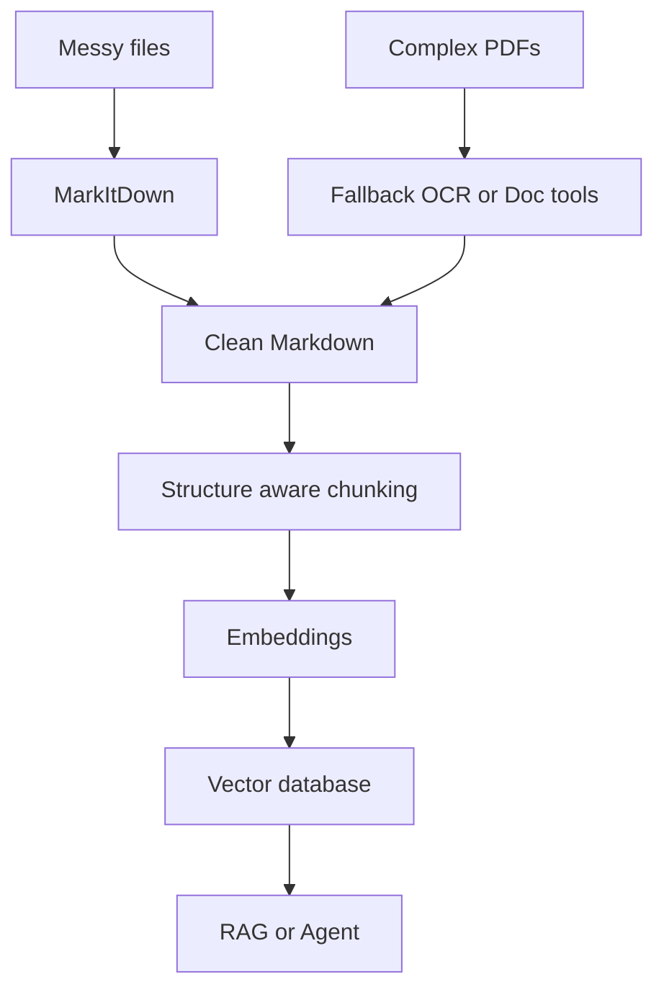

# MarkItDown pro document ingestion v AI a RAG pipeline

> [!tldr] TL;DR
> Video ukazuje [[26-04-16 RN MarkItDown]] od Microsoftu jako lehkou cestu, jak převádět PDF, Office dokumenty, obrázky, audio, HTML a další formáty do čistého [[Markdown|Markdownu]] pro [[LLM]] workflow. Hlavní pointa: problém špatných odpovědí v [[RAG]] často není model, ale nekvalitní vstup. MarkItDown není nástroj na pixel-perfect převod dokumentů pro lidi, ale praktická vrstva pro [[Document ingestion|document ingestion]], textovou analýzu, indexování a agenty.

## Kontext videa

- **Video:** [Microsoft Just Solved Document Ingestion for AI Devs (MarkItDown)](https://www.youtube.com/watch?v=9ZaiZzp4XcY)
- **Kanál:** [Better Stack](https://betterstack.com/)
- **Publikováno:** 2026-04-22
- **Délka:** 6:17
- **Oficiální repozitář:** [microsoft/markitdown](https://github.com/microsoft/markitdown)

## Hlavní myšlenka

U AI aplikací se hodně času ztrácí před samotným voláním modelu: parsování PDF, Word dokumentů, prezentací, tabulek, screenshotů, obrázků nebo audia. Když se každý formát řeší jinou knihovnou, pipeline začne být křehká:

- tabulky ztratí strukturu,
- nadpisy a hierarchie zmizí,
- vstup je zbytečně dlouhý a tokenově drahý,
- RAG vybírá špatné chunkované části,
- agent nebo chatbot potom odpovídá nepřesně.

Pointa videa: místo ladění modelu je často potřeba opravit **kvalitu vstupu**. Pro [[LLM]] workflow je strukturovaný, čistý a tokenově úsporný Markdown lepší než rozbitý text vytažený ad hoc skriptem.

## Co je MarkItDown

[[26-04-16 RN MarkItDown]] je open-source Python utilita od Microsoftu pro převod souborů a dokumentů do Markdownu. Podle oficiálního README je určená hlavně pro:

- [[LLM]] workflow,
- [[RAG]] a embedding pipeline,
- textovou analýzu,
- indexování znalostních bází,
- agenty a automatizaci.

Podporované vstupy zahrnují mimo jiné:

| Typ vstupu | Využití v AI pipeline |
|---|---|
| PDF | převod reportů, manuálů, smluv a dokumentace |
| Word / PowerPoint / Excel | firemní dokumenty, prezentace, tabulky |
| Obrázky | EXIF metadata, OCR a volitelně popisy přes LLM |
| Audio | metadata a transkripce při zapnutí příslušných extras |
| HTML, CSV, JSON, XML | webové a strukturované zdroje |
| ZIP | iterace přes obsah archivu |
| YouTube URL | extrakce obsahu videa, pokud jsou dostupné přepisy |

## Praktické příklady

### Instalace

```bash
pip install 'markitdown[all]'
```

Pro menší instalaci lze vybrat jen konkrétní formáty:

```bash
pip install 'markitdown[pdf,docx,pptx,xlsx]'
```

### Převod PDF přes CLI

```bash
markitdown path-to-file.pdf > document.md
```

Nebo s explicitním výstupním souborem:

```bash
markitdown path-to-file.pdf -o document.md
```

### Převod dokumentu v Pythonu

```python
from markitdown import MarkItDown

md = MarkItDown(enable_plugins=False)
result = md.convert("report.xlsx")

print(result.text_content)
```

### Popis obrázku přes LLM

Pro obrázky nebo prezentace lze připojit LLM klienta. To je užitečné, když dokument obsahuje grafy, screenshoty nebo vizuální informace, které běžný parser nepopíše dostatečně dobře.

```python
from markitdown import MarkItDown
from openai import OpenAI

client = OpenAI()

md = MarkItDown(
    llm_client=client,
    llm_model="gpt-4o",
)

result = md.convert("chart.png")
print(result.text_content)
```

### Použití v RAG pipeline

```python
from markitdown import MarkItDown

md = MarkItDown()
converted = md.convert("product-manual.pdf")

markdown_text = converted.text_content

# Dalsi kroky:
# 1. rozdelit markdown podle nadpisu a sekci
# 2. vytvorit embeddingy
# 3. ulozit chunky do vektorove databaze
# 4. pri dotazu vyhledat relevantni casti a predat je LLM
```

## Kdy se MarkItDown hodí

MarkItDown dává smysl, když:

- stavíš [[RAG]] nad mixem dokumentů,
- potřebuješ jednotnou ingestion vrstvu pro více formátů,
- nechceš udržovat vlastní sadu křehkých parserů,
- je pro tebe důležitá rychlost a jednoduchost,
- výstup bude číst primárně LLM, ne člověk jako finální publikovaný dokument.

Typické použití:

- znalostní báze pro interní chatbot,
- firemní dokumentace ve Word/PDF,
- analýza reportů a tabulek,
- předzpracování dat pro fine-tuning dataset,
- agent, který potřebuje číst soubory od uživatele,
- MCP integrace do nástrojů typu Claude Desktop.

## Srovnání s alternativami

| Nástroj | Silná stránka | Slabina / trade-off |
|---|---|---|
| [[Pandoc]] | publikování, formátování, LaTeX, dokumenty pro lidi | není optimalizovaný primárně pro LLM pipeline |
| MarkItDown | rychlý Markdown pro LLM, RAG, agenty a automatizaci | nemusí zvládnout velmi komplexní nebo vizuálně složité dokumenty |
| Unstructured | robustnější zpracování složitějších dokumentů | těžší setup, pomalejší a komplexnější provoz |
| Docling / DocQuery | lepší pro náročné dokumenty a specializovanou extrakci | větší režie než jednoduchý converter |

> [!warning] Limitace
> MarkItDown není univerzální řešení pro všechny dokumenty. Husté tabulky, naskenované dokumenty, složité layouty a nekvalitní PDF mohou vyžadovat specializované nástroje, OCR nebo Azure Document Intelligence.

## Doporučený postup pro vlastní projekty

1. Začni s MarkItDown jako výchozí ingestion vrstvou.
2. Výstup ukládej jako Markdown, ne jen jako plochý text.
3. Chunkování dělej podle nadpisů, seznamů a tabulek, ne náhodně po N znacích.
4. U obrázků a grafů připoj LLM popis, pokud jsou důležité pro odpovědi.
5. Pro problematické dokumenty měj fallback na těžší nástroje typu Unstructured, Docling nebo Document Intelligence.

> [!success] Best practice
> Pro RAG je důležitější zachovat strukturu dokumentu než vytvořit vizuálně krásný převod. Nadpisy, tabulky, seznamy a odkazy jsou signály, podle kterých se dá lépe chunkovat a vyhledávat.

> [!example] Mini architektura
> `soubory -> MarkItDown -> markdown -> chunking podle struktury -> embeddings -> vector DB -> retrieval -> LLM odpoved`

## Odkazy

- [YouTube video](https://www.youtube.com/watch?v=9ZaiZzp4XcY)
- [MarkItDown GitHub repo](https://github.com/microsoft/markitdown)
- [Better Stack](https://betterstack.com/)
- [Better Stack Community Tutorials](https://betterstack.com/community/)
- [BetterStackHQ example projects](https://github.com/BetterStackHQ)
- [Better Stack na LinkedIn](https://www.linkedin.com/company/betterstack)
- [Better Stack na X/Twitteru](https://twitter.com/betterstackhq)

## Vizualizace



## Související

[[RAG]] · [[LLM]] · [[Markdown]] · [[Document ingestion]] · [[Embeddingy]] · [[Vector Database]] · [[MCP]] · [[Pandoc]]

#AI #RAG #LLM #MarkItDown #document-ingestion
