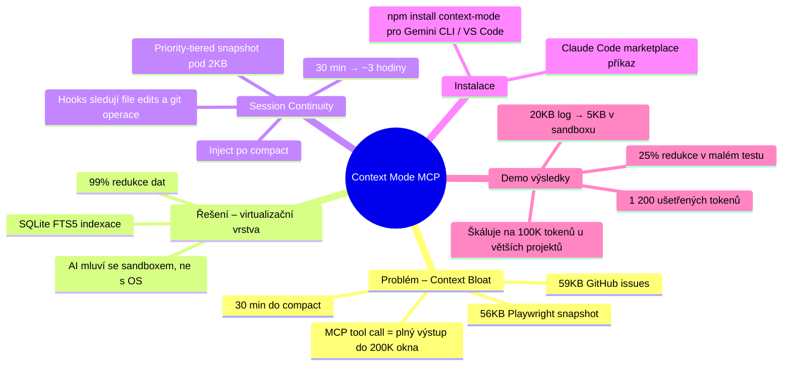

-----

title: “Context Mode MCP – řešení context bloatu v Claude Code”
date: 2026-04-02
tags:

- zdroj/youtube
- téma/claude-code
- téma/mcp
- téma/ai-agent-workflow
- téma/token-optimalizace
  status: sumarizováno
  zdroj: “https://youtu.be/QUHrntlfPo4?si=DcmV1d2trEOJZ2Ma”

-----

> [!summary] Podstata v 30 vteřinách
> 
> - Každé volání MCP nástroje v Claude Code vkládá svůj plný výstup přímo do kontextového okna, což způsobuje rychlé vyčerpání 200K limitu – typicky za 30 minut aktivní práce agenta.
> - Context Mode funguje jako virtualizační mezivrstva: výstupy nástrojů indexuje do lokální SQLite databáze s full-text vyhledáváním a modelu vrací pouze potvrzení (desítky bytů místo desítek kilobytů).
> - Po každém compactu konverzace Context Mode rekonstruuje stav session z prioritního snapshotu (< 2 KB), čímž prodlužuje efektivní délku session z ~30 minut na ~3 hodiny a eliminuje zapomínání předchozích rozhodnutí a chyb.

-----

## Vrstva 2 – Klíčové pasáže

[[Context Mode]] je odpovědí na jeden z nejpalčivějších problémů [[Claude Code]] a AI agentů obecně: **context bloat**, kdy výstupy MCP nástrojů rychle saturují kontextové okno.

Matematika je krutá: jediný **Playwright snapshot** webové stránky má ~56 KB, načtení 20 GitHub issues ~59 KB. Když tyto operace proběhnou vícekrát v plánovací fázi, agent spotřebuje **70 % kontextového okna ještě před napsáním jediného řádku kódu**.

**Context Mode jako virtualizační vrstva** mění tok dat: místo přímé komunikace AI ↔ OS vstupuje sandbox, který data indexuje do [[SQLite FTS5]] databáze. Model dostane pouze potvrzení o indexaci – ne surová data. Výsledky jsou dramatické:

|Zdroj dat          |Původní velikost|Po Context Mode|Redukce |
|-------------------|----------------|---------------|--------|
|Playwright snapshot|56 KB           |299 B          |**99 %**|
|Analytics CSV      |velký soubor    |222 B          |~100 %  |
|Access log (demo)  |20 KB           |5 KB           |**25 %**|

> [!warning] Skrytý náklad přetrvávajících dat
> Data v kontextovém okně nejsou jednorázový náklad – jsou **resílána s každou zprávou**. I 1 200 ušetřených tokenů z malého souboru se při delší session vynásobí desítky- až stokrát.

> [!tip] Session Continuity jako „uložená pozice”
> Context Mode pomocí hooks sleduje každou změnu souboru, git operaci a sub-agentní úlohu. Po compactu sestaví **prioritní snapshot** (obvykle pod 2 KB) a injektuje ho zpět do kontextu. Agent si tak pamatuje i chyby z před 20 minut – a neopakuje je.

Klíčová myšlenka přesahuje úsporu peněz: **čistější kontext = lepší reasoning**. Model má prostor skutečně přemýšlet, místo aby procházel hromadu nástrojových výstupů.

-----

## Vrstva 3 – Zlaté pasáže

> [!note] Zlaté pasáže
> ==Context Mode funguje jako virtualizační vrstva. Místo toho, aby AI komunikovala přímo s operačním systémem, komunikuje se sandboxem – a místo vkládání masivních výstupů je indexuje do lokální SQLite databáze s využitím FTS5.==
> ==Když vyčistíte šum z kontextového okna, uvolníte prostor pro skutečné uvažování. Dáváte Claudovi prostor, který potřebuje, aby byl lepším inženýrem.==
> ==Je to v podstatě uložená pozice vaší kódovací session – hypoteticky můžete prodloužit délku session z 30 minut na přibližně 3 hodiny.==

-----

## Vrstva 1 – Surové úryvky

> „Každé volání MCP nástroje v Claude Code je směšně drahé, protože každé takové volání vloží svůj plný výstup přímo do 200K kontextového okna modelu.”

> „Jediný Playwright snapshot webové stránky má přibližně 56 kilobajtů. Načtení 20 GitHub issues je 59 kilobajtů. Pokud tyto operace provedete v plánovací fázi vícekrát za session, pravděpodobně jste spotřebovali 70 % okna ještě předtím, než agent napsal jediný řádek kódu.”

> „Context Mode využívá hooks ke sledování každé editace souboru, git operace a úlohy sub-agenta. Když se vaše konverzace kompaktuje, Context Mode sestaví prioritní snapshot, obvykle pod dva kilobajty, a injektuje ho zpět.”

> „Pokud AI vyzkoušela opravu, která před 20 minutami selhala, tuto chybu nezopakuje, ani když se kontext resetuje.”

> „Úspora 1 200 tokenů se u větších souborů snadno změní na 100 000 tokenů.”

-----

*Zdroj: [Claude Code is Expensive. This MCP Server Fixes It (Context Mode) – Better Stack](https://youtu.be/QUHrntlfPo4?si=DcmV1d2trEOJZ2Ma)*